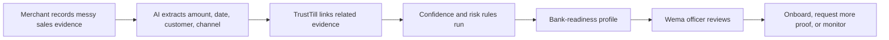
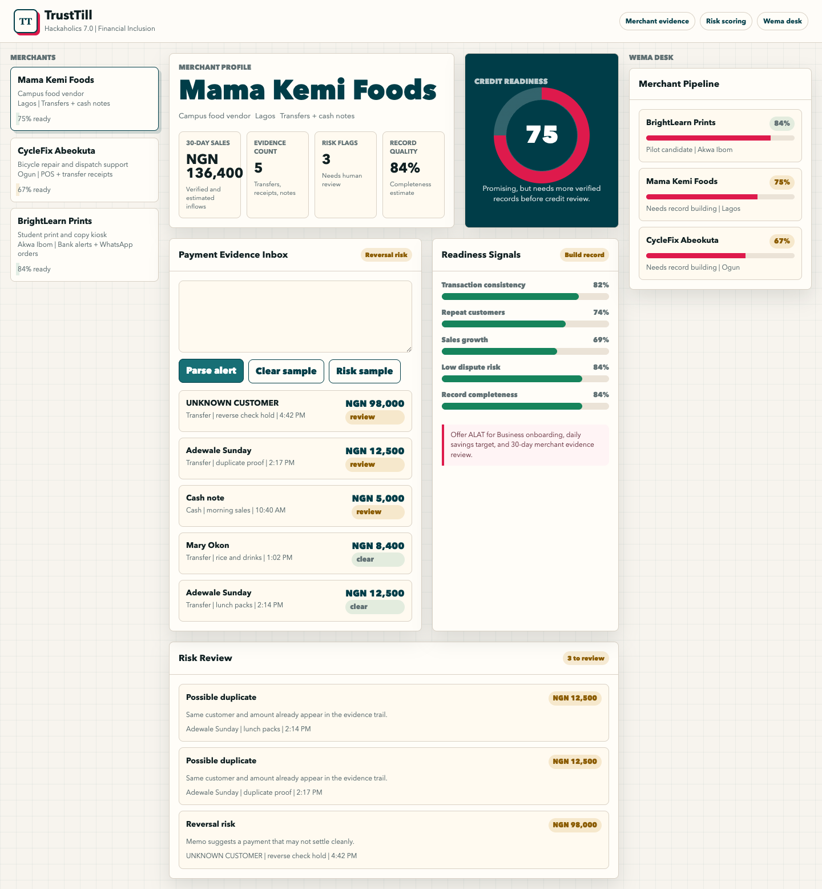
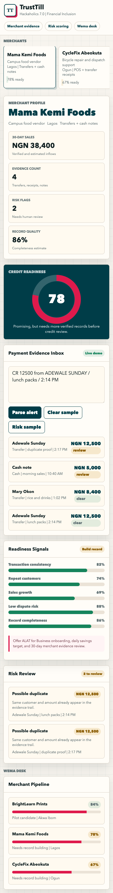

# TrustTill

TrustTill helps offline-first informal Nigerian merchants turn messy sales evidence into clean cashflow records, fraud-risk signals, and bank-readiness profiles.

Built for **Wema Bank Hackaholics 7.0**, **Financial Inclusion** track.

Built by a backend engineer with 6 years of experience designing APIs, data workflows, and service architecture.

## Demo Story

Many micro-merchants make real sales every day, but their business history is scattered across cash transactions, SMS alerts, WhatsApp messages, receipt photos, stock movements, and memory. That makes them hard to onboard, support, or evaluate for future financial products.

TrustTill turns those traces into structured merchant evidence:

- Payment evidence in
- Clean cashflow out
- Risk flags visible
- Bank-readiness profile generated
- Wema gets a practical onboarding and pilot pathway

## Live Demo

Open `index.html` in any browser.

The demo is a static, frontend-only prototype. It includes seeded merchant profiles, a payment-alert parser, a transparent risk engine, bank-readiness scoring, and a Wema Desk pipeline view.

## Core Demo Flow

1. Select **Mama Kemi Foods**.
2. Paste or use this sample alert:

   ```txt
   CR 12500 from ADEWALE SUNDAY / lunch packs / 2:14 PM
   ```

3. Click **Parse alert**.
4. Watch the evidence count, readiness score, and risk review update.
5. Use **Risk sample** to show a suspicious payment alert.

## User Flow



## Why This Matters To Wema

TrustTill is not trying to replace banking infrastructure. It is an evidence layer that can help Wema identify, onboard, and support informal merchants who are already economically active but not yet bankable.

Potential Wema value:

- Acquire informal merchants into ALAT or SME banking.
- Improve merchant record quality before lending.
- Identify promising micro-businesses for pilot programs.
- Reduce fraud and dispute risk during onboarding.
- Support financial inclusion with practical merchant data.

## Screenshots

Desktop:



Mobile:



## Pitch Assets

- `docs/trusttill_pitch_deck.pptx` - editable seven-slide pitch deck
- `docs/pitch_deck.md` - slide outline
- `docs/demo_script.md` - 90-second and 3-minute demo scripts
- `docs/product_faq.md` - product reasoning, scope, and pilot answers

## Prototype Features

- Merchant dashboard
- Payment evidence inbox
- Alert parser for messy transfer messages
- Rule-based risk review
- Bank-readiness score
- Wema Desk merchant pipeline
- Responsive desktop and mobile layout

## Backend Direction

The production version should be API-first:

- Evidence ingestion API for bank alerts, cash entries, receipt photos, POS records, and WhatsApp/order notes.
- Extraction service that converts messy evidence into normalized transaction records.
- Matching service that links sales, receipts, deposits, customer confirmations, and inventory changes.
- Risk service that creates transparent flags instead of black-box loan decisions.
- Merchant profile API for Wema/ALAT onboarding, review, and pilot workflows.

See `docs/backend_architecture.md` for the proposed data model, API routes, confidence scoring, and implementation plan.

## Risk Rules In The Prototype

TrustTill uses transparent rules for the MVP:

- Same amount and customer appearing twice: possible duplicate.
- Memo includes reverse, refund, or hold: reversal risk.
- Amount is far above the merchant pattern: unusual amount.
- Unknown customer: weak customer proof.
- High cash-note share: low record completeness.

## Hackathon Positioning

One-line pitch:

> TrustTill makes informal merchants bankable by turning the payment evidence they already generate into cashflow, risk, and readiness signals.

Memorable judge line:

> We are not asking informal merchants to become accountants. We are making the business evidence they already have count.

## Suggested Next Build

- Add real OCR/SMS/WhatsApp parsing.
- Add merchant consent and privacy controls.
- Add Wema/ALAT API mock integration.
- Add loan-readiness guardrails and human review.
- Add local-language explanations for merchants.

## Project Structure

```txt
.
├── README.md
├── index.html
├── assets/
│   └── screenshots/
│       ├── desktop.png
│       └── mobile.png
├── data/
│   └── sample_merchants.json
└── docs/
    ├── demo_script.md
    ├── backend_architecture.md
    ├── deployment.md
    ├── pitch_deck.md
    ├── product_faq.md
    └── trusttill_pitch_deck.pptx
```

## Status

Prototype. Built as a hackathon demo for strategy, application support, and fast iteration.
