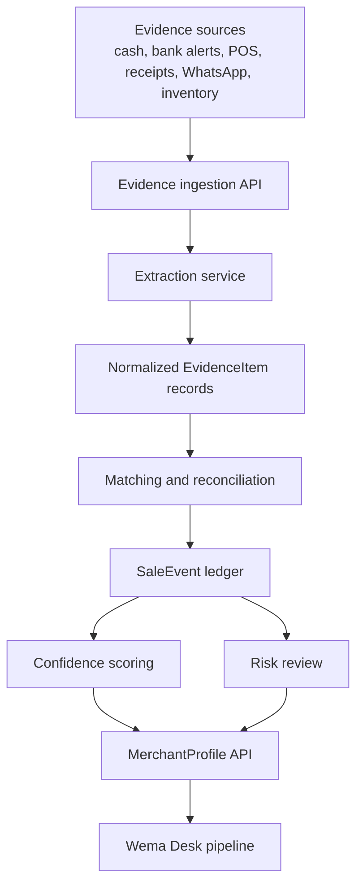

# TrustTill Backend Architecture

TrustTill should be built as an evidence-processing backend, not as a black-box lending engine.

The backend goal is simple:

> Accept messy merchant evidence, normalize it into structured records, link related evidence, score confidence transparently, and expose a Wema-readable merchant profile.

## System Flow



## Core Services

### 1. Evidence Ingestion

Accepts raw evidence from many sources:

- cash sale entries
- bank transfer alerts
- POS receipts
- paper receipt images
- WhatsApp or Instagram order notes
- supplier purchase notes
- end-of-day cash totals
- bank deposits
- customer confirmations
- inventory changes

Every input is stored first as an `EvidenceItem`. TrustTill should not immediately assume an input is true.

### 2. Extraction

Parses each evidence item into structured fields:

- amount
- date and time
- customer or payer
- item or memo
- payment channel
- reference number
- source type
- extracted confidence

For the MVP, this can use deterministic parsers plus an LLM extraction fallback. In production, bank/POS integrations should be treated as higher-trust sources than free text.

### 3. Matching

Links related evidence into one `SaleEvent`.

Example:

- WhatsApp order: "2 bags rice, I will transfer 18,500"
- bank alert: "CR 18,500 from Sade Okoro"
- receipt: "2 bags rice - 18,500"

The matching service compares amount, timestamp, customer similarity, reference number, and item description.

### 4. Confidence Scoring

TrustTill does not pretend all sales are verified.

Suggested confidence levels:

- `verified`: bank/POS data or multiple matching evidence sources
- `supported`: manual sale with receipt, inventory, deposit, or customer confirmation
- `manual`: merchant-entered claim without support
- `flagged`: duplicate, inconsistent, edited-looking, reversed, or unusual evidence

The score should be explainable. A Wema officer must see why a record is trusted or flagged.

### 5. Risk Review

Risk flags should be transparent and conservative:

- duplicate reference number
- reversal/refund/hold memo
- impossible timestamp
- amount far above normal merchant pattern
- high manual-cash share with no deposit support
- customer name mismatch across linked evidence
- sales spike without matching inventory or deposit pattern

The system should not auto-approve loans. It prepares evidence for human review.

## Data Model

```txt
Merchant
  id
  name
  sector
  location
  phone
  alat_or_wema_status
  created_at

EvidenceItem
  id
  merchant_id
  source_type
  raw_text_or_file_url
  extracted_amount
  extracted_customer
  extracted_reference
  extracted_at
  confidence_hint

SaleEvent
  id
  merchant_id
  amount
  occurred_at
  customer_name
  channel
  status
  confidence_level
  confidence_reason

EvidenceLink
  sale_event_id
  evidence_item_id
  match_strength
  match_reason

RiskFlag
  id
  merchant_id
  sale_event_id
  severity
  reason
  created_at

MerchantProfile
  merchant_id
  verified_revenue_30d
  supported_revenue_30d
  manual_claims_30d
  flagged_amount_30d
  repeat_customer_count
  evidence_quality
  recommended_next_step
```

## API Sketch

```http
POST /api/merchants
POST /api/merchants/:merchantId/evidence
POST /api/merchants/:merchantId/evidence/batch
POST /api/evidence/:evidenceId/extract
POST /api/merchants/:merchantId/reconcile
GET  /api/merchants/:merchantId/profile
GET  /api/merchants/:merchantId/risk-flags
GET  /api/wema/pipeline
```

Example response:

```json
{
  "merchantId": "mama-kemi-foods",
  "verifiedRevenue30d": 420000,
  "supportedRevenue30d": 165000,
  "manualClaims30d": 78000,
  "flaggedAmount30d": 22500,
  "evidenceQuality": "medium_high",
  "recommendedNextStep": "Onboard to ALAT for Business and review for 30-day pilot"
}
```

## MVP Build Plan

1. Static demo with seeded merchant data and rule-based parsing.
2. Go backend for evidence ingestion, profile generation, risk review, and Wema pipeline APIs.
3. PostgreSQL or SQLite schema for merchants, evidence, sale events, and risk flags.
4. LLM extraction for messy text, guarded by deterministic validation rules.
5. Wema Desk view for pipeline review.
6. Optional GitHub Pages frontend plus hosted API on Render/Fly/Vercel.

## Judge-Safe Positioning

TrustTill is not a production credit score and should not claim automated loan approval.

The safe positioning is:

> TrustTill creates a confidence-scored evidence trail that helps Wema understand, onboard, and support informal merchants.
